# LIS 學科 3 年的 epistemic shift（跨學科總覽）

> LIS × AI cross-disciplinary read — 2026-05-16

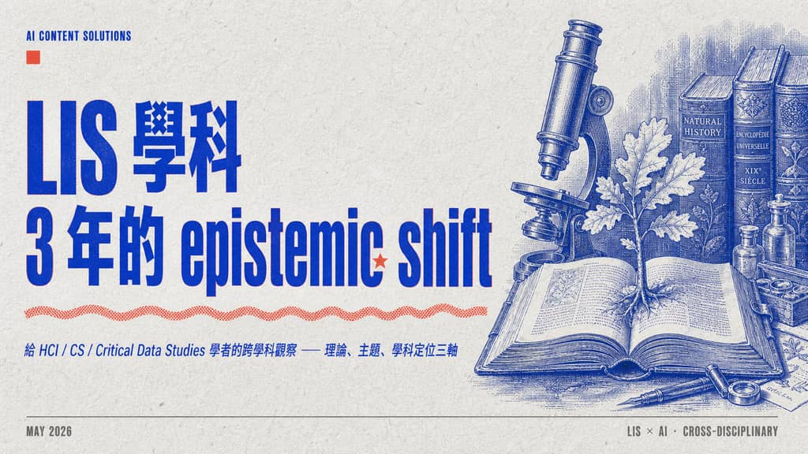

## Hook

給 HCI / CS / Critical Data Studies 學者的跨學科觀察報告。從 LIS 經典假設（Bates / Belkin / Kuhlthau / Cutter / Saracevic / Sandy Berman 等）出發、追蹤 AI 進場後位移與三大讀者群的 implications。這是後續 12 個 deck 的索引起點——之後的 deck 全部 anchor 在 2023-2026 frameworks。

## Slides

### Slide 01

cover

### Slide 02

why care

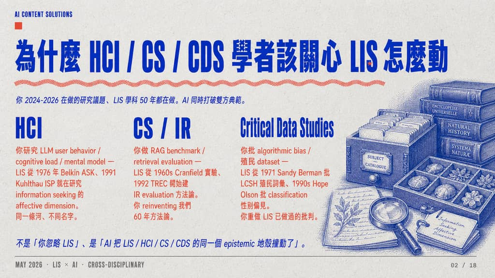

### Slide 03

five classics

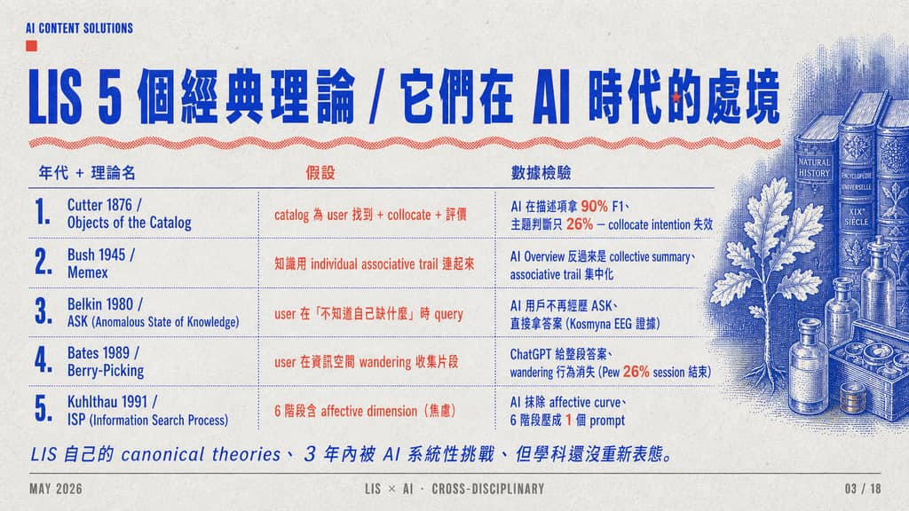

### Slide 04

bates berry picking

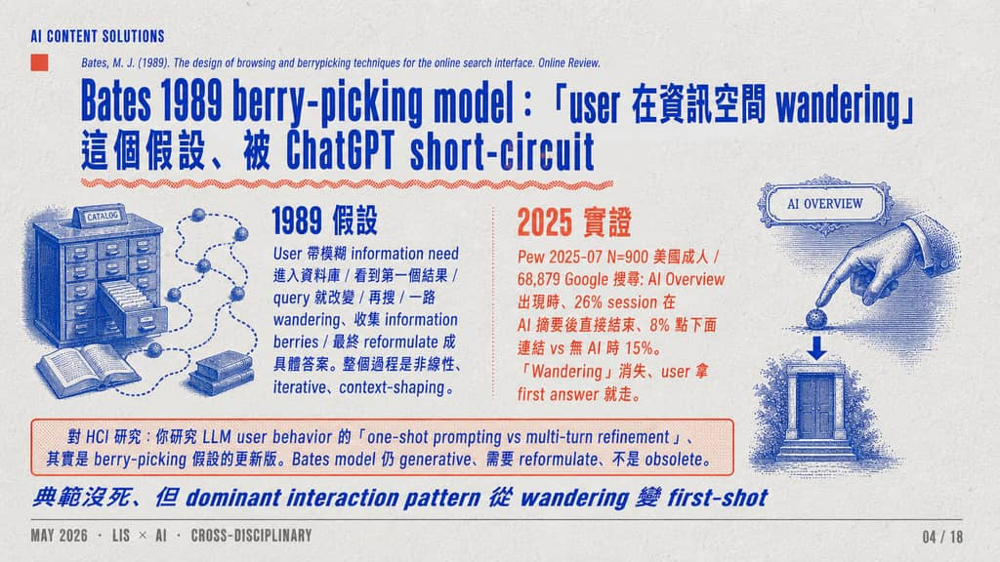

### Slide 05

belkin ask

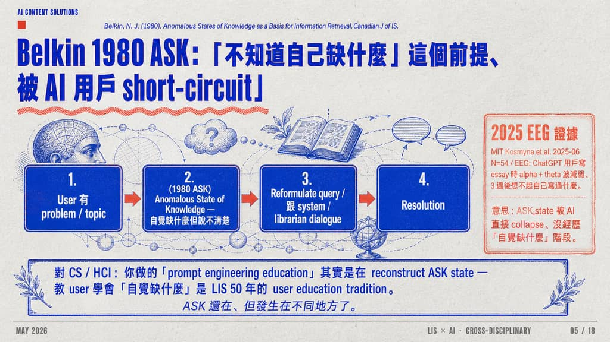

### Slide 06

kuhlthau isp

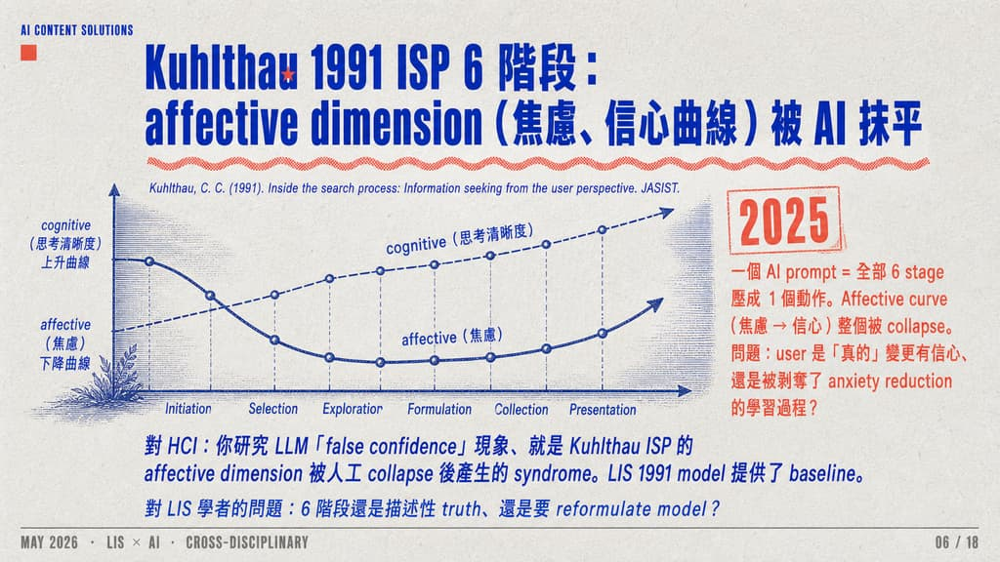

### Slide 07

cutter objects

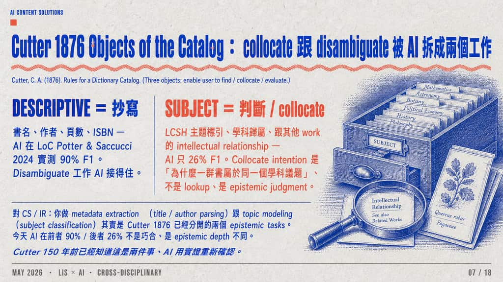

### Slide 08

jasist themes

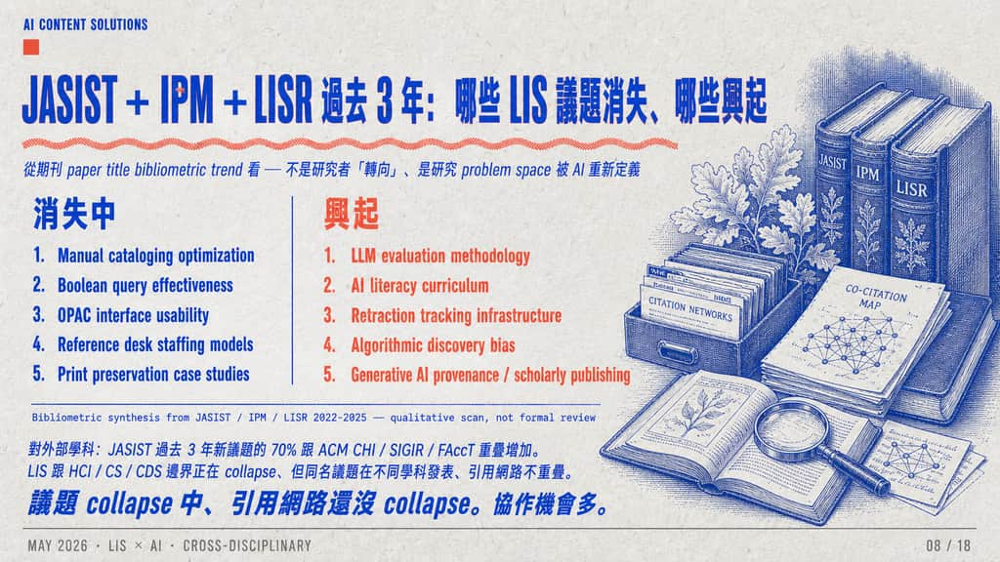

### Slide 09

ischools thesis

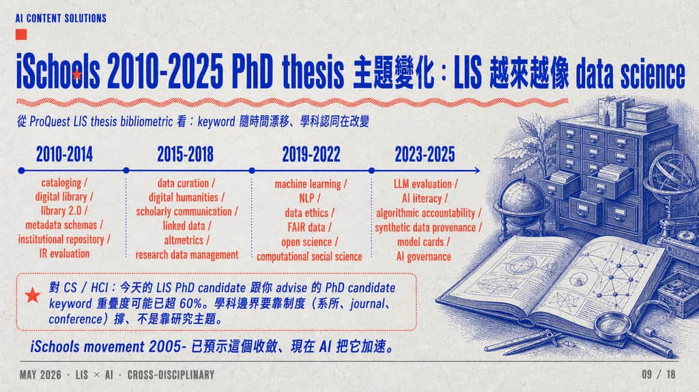

### Slide 10

vs cs

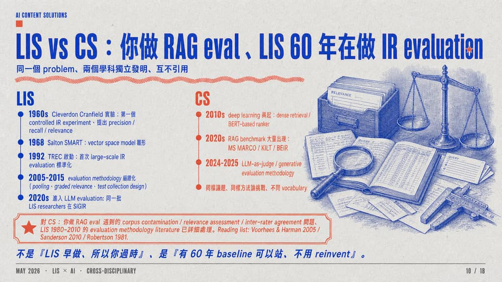

### Slide 11

vs hci

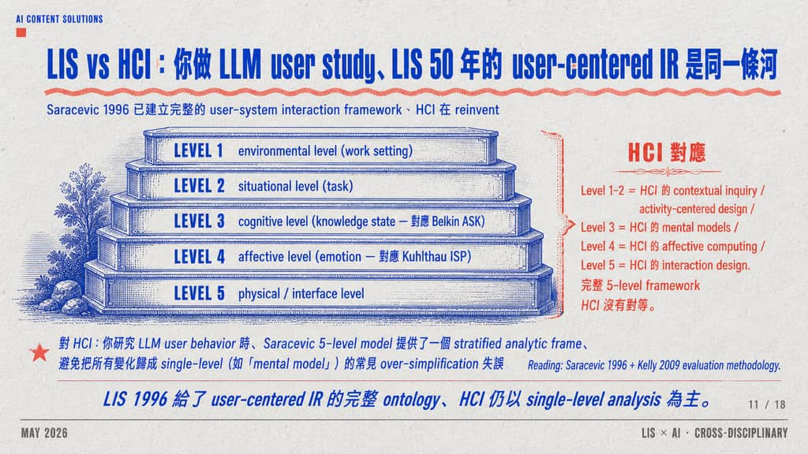

### Slide 12

vs cds

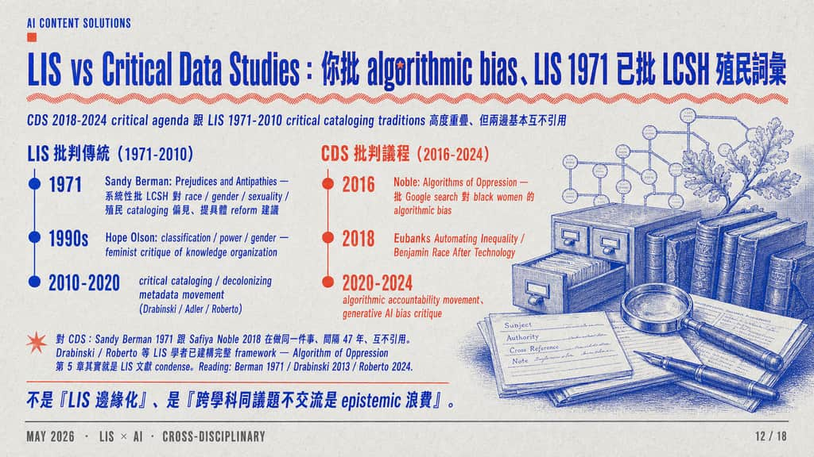

### Slide 13

ischools

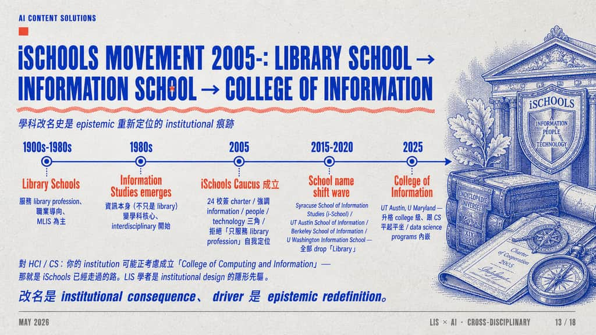

### Slide 14

shared shift

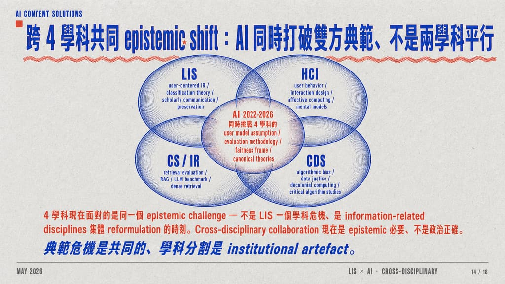

### Slide 15

implications hci

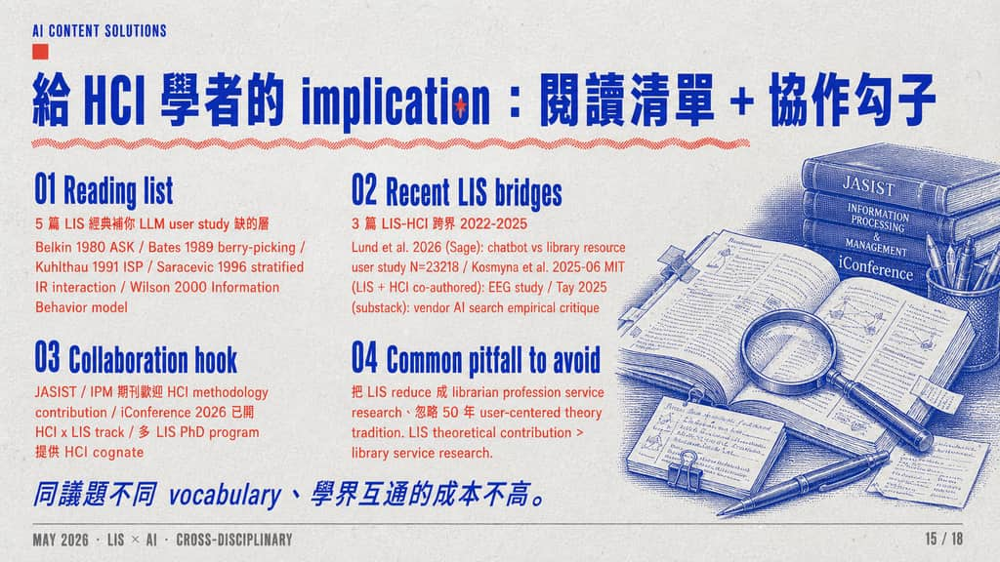

### Slide 16

implications cs

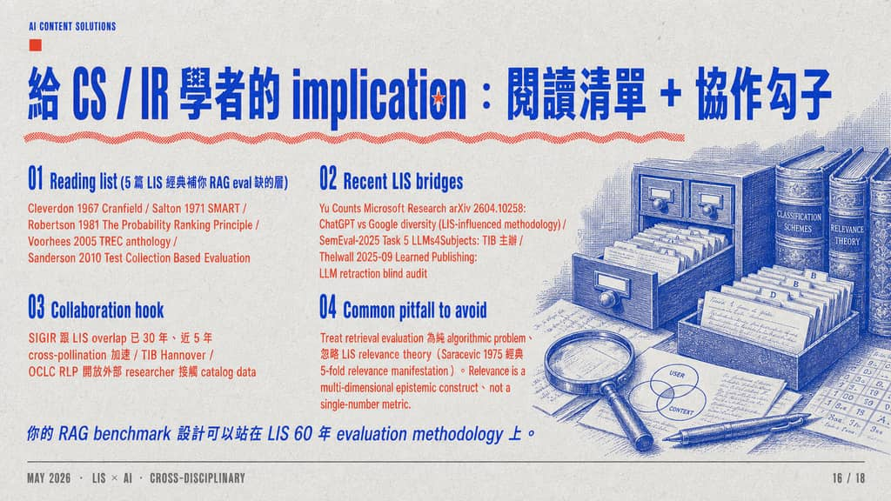

### Slide 17

implications cds

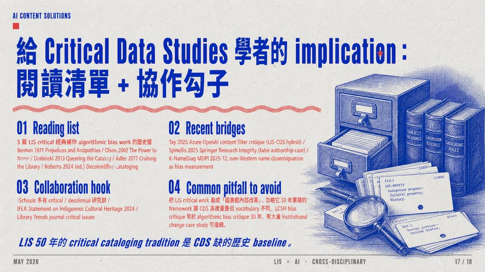

### Slide 18

closing

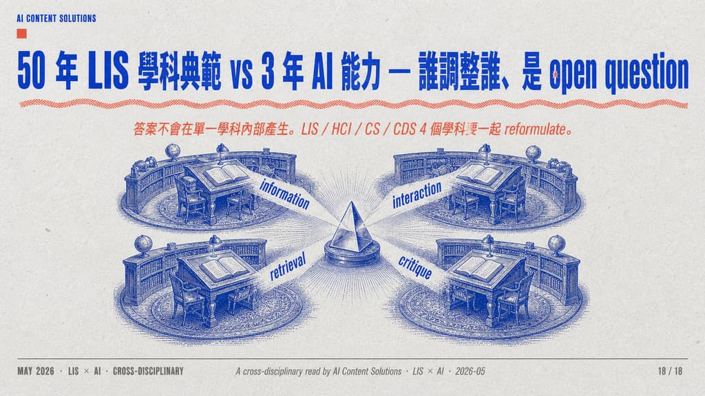

